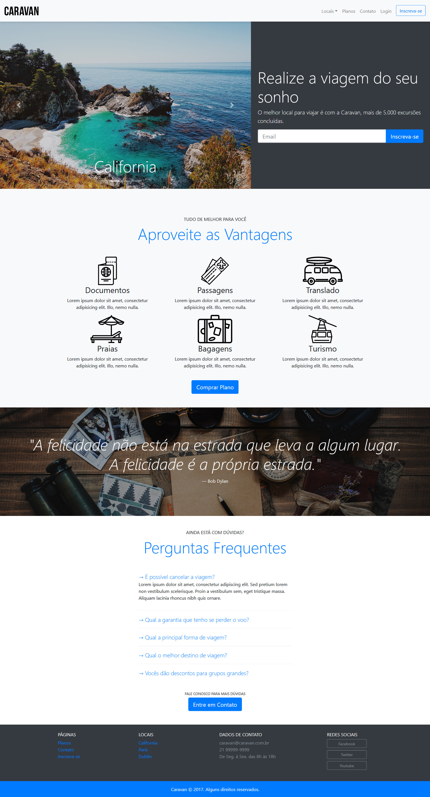

# Caravan Bootstrap

    

O Projeto <strong>Caravan Bootstrap</strong> foi baseado totalmente no bootstrap 4 e nas tecnologias web HTML, CSS e Javascript. Algumas alterações foram feitas com CSS puro, mas este projeto visa utilizar o máximo do bootstrap, sem precisar estilizar com css puro.
 
 

# :computer: Layout

 
 
